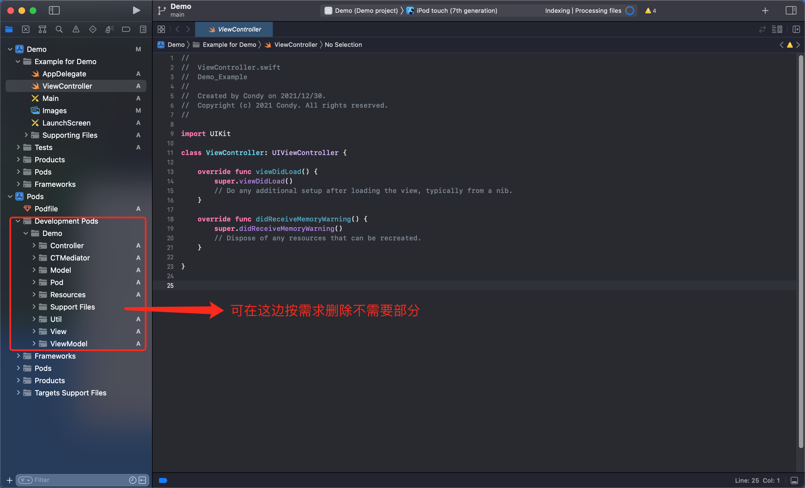

# pod-template

- Automatically generate componentized modules
- 自动生成组件化模块

### Swift
- cd 任意目录文件
- 自动快捷创建Swift组件模块，终端执行如下命令

#### pod lib create Demo swift --template-url="https://github.com/yangKJ/pod-template"
- 将上述**`Demo`**换成你的工程名即可 ⚠️

### 目录结构
- 自动生成组件化模块目录结构如下，该区域删除或者增加模块

